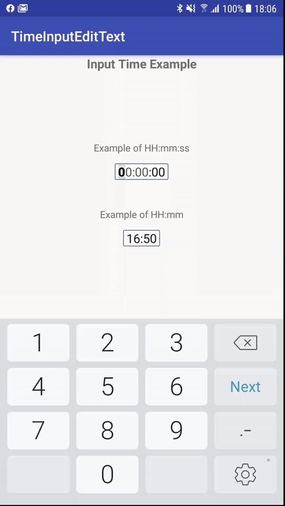
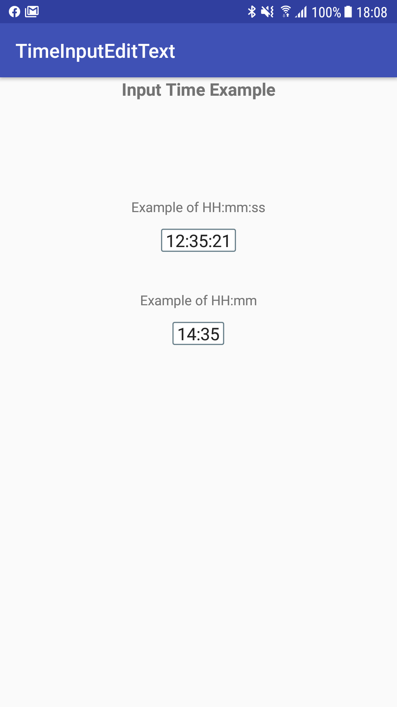

# TimeInputEditText
This is an implementation of a input field which takes input as HH:mm or HH:mm:ss and handle formatting dynamically.

# See how it works (You can see validation in video, where it does not allow invalid input)

Video - GIF

Screenshot

